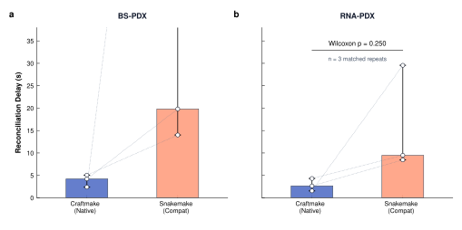

# craftmake

`craftmake` is the native workflow executor for [`otter`](https://github.com/). It compiles versioned workflow YAML into task DAGs, runs tasks locally or through Slurm, persists state in SQLite, and exposes caching, recovery, cancellation, logs, and reports.

> **Project status (2026-09-05):** The control-plane implementation is substantially complete. The accepted Gate 6 scope includes bounded Craftmake–Snakemake executor evidence, corrected Gate A–D evidence, and Methx/Methrix parity. The fresh seven-input legacy-equivalent matrix was not run; representative repeats, production-scale throughput, WGBS, and additional Snakemake recovery are deferred and non-blocking. This repository must not be described as production-throughput approved.

## At a glance

| Capability | Status |
| :--- | :--- |
| Native Local and Slurm execution | Implemented and tested |
| SQLite state, task caching, resume, cancellation | Implemented and tested |
| Immutable run/reference boundary | Accepted in Gate 6 runtime evidence |
| Craftmake/Snakemake executor parity | Accepted for RRBS, RNA-seq, BS-PDX, and RNA-PDX bounded runs |
| Repeated PDX scheduler comparison | Three paired repeats per scenario; descriptive evidence |
| Representative matrix and production-scale throughput | Deferred, non-blocking future qualification |
| WGBS | Deferred |

## Scope

### Supported

- Workflow families: BeaverBS, BeaverPDX, BeaverRNA, and BeaverRNASEQPDX.
- Backends: Local execution with admission budgets and native Slurm execution.
- State: SQLite run/task/submission records, Controller JSONL, cache decisions, retries, and resume.
- Evidence: task metrics, Slurm accounting, artifact manifests, exact/structural/scientific comparisons, and immutable checksums.

### Not supported by the first release

- Creating `otter` projects, scanning FASTQ files, or generating domain configuration.
- An embedded Snakemake interpreter. Snakemake remains an explicit compatibility executor outside the Craftmake binary.
- Kubernetes, cloud batch, generic container backends, or cross-phase global DAG execution.
- Full production-scale biology, throughput, or statistical-power claims from small samples.

## Current progress

The current implementation is strongest in the execution control plane: CLI and protocol handling, workflow compilation, Local and Slurm scheduling, SQLite state, task caching, recovery, cancellation, accounting refresh, release archives, catalog routing, and structured evidence are implemented and covered by repository tests.

### Gate 6 evidence status

| Area | Evidence completed | Current status |
| :--- | :--- | :--- |
| Runtime and references | Immutable releases, role-explicit references, checksum sealing, and Paracloud compute-node preflight. | **Accepted** |
| RRBS executor parity | Craftmake and explicit Snakemake runs passed artifact parity, recovery exercises, publication retry, failed-task retry, and semantic review. | **Accepted** |
| RNA-seq executor parity | Paired runs completed through publication; RNA manifests passed verification and comparison. | **Accepted** |
| BS-PDX executor parity | Byte-identical filtered BAM/BAI; `97,182` mapped graft reads. | **Accepted** |
| RNA-PDX executor parity | Byte-identical filtered BAM/BAI; `118,596` mapped graft reads. | **Accepted** |
| PDX scheduler benchmark | Three balanced Craftmake/Snakemake pairs per scenario for `step2-check`. | **Accepted, bounded** |
| Representative matrix | 20-cell matrix with repeated runs. | **Deferred, non-blocking** |
| Scale benchmark | Production throughput and scheduler-pressure test. | **Deferred, non-blocking** |
| WGBS | Production workflow path and canary. | **Deferred** |

All accepted workflow evidence is either synthetic or bounded public-data canary evidence. It establishes orchestration, file contracts, executor parity, and selected recovery behavior. It does not establish full biological coverage or production throughput.

### Workflow readiness

| Workflow | Workflow assets and local contracts | Real Slurm / parity position |
| :--- | :--- | :--- |
| **BeaverBS** | Complete | Synthetic chain and RRBS executor-parity/recovery evidence accepted |
| **BeaverPDX** | Complete | Synthetic chain, direct Xenofilx replay, and paired executor parity accepted |
| **BeaverRNA** | Complete | Paired executor run through publication accepted |
| **BeaverRNASEQPDX** | Complete | Direct Xenofilx replay and paired executor parity accepted |

The implementation status and historical evidence remain in [doc/implementation-plan.md](doc/implementation-plan.md). The parent repository's benchmark policy is in [`../docs/benchmark-plan.md`](../docs/benchmark-plan.md).

### Standalone configurations

`craftmake.standalone/v1` runs a generic DAG without an Otter sample/reference identity contract. The configuration must declare a workflow name, phase, backend, and absolute project directory; it may declare samples and Slurm defaults. The configuration loader is selected deterministically:

- `otter.run/v1` uses the immutable Otter run loader.
- A complete legacy Otter shape uses the legacy compatibility loader.
- `craftmake.standalone/v1` uses the strict standalone loader.
- Ambiguous configurations fail closed and must declare a schema version.

Standalone workflow identity is intentionally independent from `workflow.name`, while phase matching remains mandatory. Use the hidden `--standalone` flag only to assert that a supplied config is standalone. The generic SRA archive decoder is `workflows/SRAArchiveDecode/decode.yaml`; it validates archive size, MD5, SHA-256, and transfer manifest on the compute node, runs `fasterq-dump --split-files`, compresses deterministically with `pigz -n`, audits paired FASTQ records, and atomically creates a read-only output root.

## Craftmake and Snakemake

Both executors consume the same immutable `run.yaml` when parity is measured. Inputs, references, workflow assets, resource envelopes, and artifact contracts are held fixed; task decomposition and state implementation may differ.

| Concern | Craftmake | Snakemake compatibility executor |
| :--- | :--- | :--- |
| Execution model | Versioned Craftmake YAML compiled to a native task DAG | Compatibility projection generated from `run.yaml` |
| Runtime state | SQLite task state plus Controller JSONL | Compatibility runtime state plus Otter-retained controller/accounting evidence |
| Failure model | Classified `otter.runtime-incident/v1` records and retry policy | Compatibility-controller outcome, Slurm accounting, and artifact evidence |
| Metrics | Per-task metrics, allocations, events, and reports | Controller and Slurm accounting evidence collected for paired comparisons |
| Artifact publication | Create-only, dimension-aware manifest publication and verification | Same post-success publication and verification contract |
| Default role | Default executor | Explicit compatibility path; no automatic fallback |

## Current scheduler benchmark

The current benchmark measures **controller reconciliation time** for the PDX `step2-check` phase: the interval from the final worker completion to the controller's terminal completion. It does not include queue delay.

**Fixed conditions:** release `gate6-20260812T104500Z-pdx-host-fasta-r41`, Paracloud Slurm, matched prerequisites, matched reference roles, matched resource envelope, and three paired repeats per scenario. All 12 cells passed input-content parity, filtered BAM/BAI checksum parity, and mapped-read parity.



| Scenario | Craftmake median (min–max), s | Snakemake median (min–max), s | Median paired difference, s |
| :--- | ---: | ---: | ---: |
| BS-PDX | 4.213 (2.385–5.057) | 19.819 (14.008–164.668) | 15.606 |
| RNA-PDX | 2.651 (1.552–4.308) | 9.478 (8.458–29.556) | 5.807 |

The bars show medians, whiskers show observed min–max ranges, and connected points show matched repeats. Exact two-sided Wilcoxon signed-rank `p = 0.250` for both scenarios. With `n = 3`, this is descriptive evidence, not a significance claim.

Within this release, phase, compatibility projection, and cluster environment, Craftmake showed lower and narrower observed reconciliation delays. The result is not a general executor-speed ranking: Craftmake used three worker jobs per cell, while the Snakemake compatibility projection used one. Queue delay, worker makespan, and reconciliation are reported as separate metrics.

Full source data, derived statistics, the reproducible generator, and checksums are in [doc/benchmarks/README.md](doc/benchmarks/README.md).

## Next plan

Work proceeds in immutable releases and fresh project/run roots. Historical releases and evidence are not modified.

### Current Gate 6 closeout

1. Review and archive the [Gate 6 closeout evidence register](../docs/gate6-closeout-evidence-register.json).
2. Record the final Gate 6 decision log and preserve the explicit limitation that the fresh seven-input legacy-equivalent matrix was not run.
3. Perform BS-PDX publication and complete artifact-manifest verification only if formal publication is required.

### Deferred extensions

The following work is intentionally outside the current Gate 6 closeout boundary:

- fresh seven-input legacy-equivalent scientific matrix;
- representative `20 samples × 3 repeats` matrix;
- production-scale throughput and scheduler-pressure qualification;
- WGBS `SRR6373947` reference/acquisition requalification;
- additional Snakemake interruption, retry, resume, and recovery comparison.

These items require separate authorization and new evidence boundaries. The existing Snakemake material remains accepted historical executor/recovery evidence; Craftmake remains the default workflow executor, with no embedded Snakemake interpreter.

## Quick start

### Build and install

```bash
make build
./build/craftmake --version
sudo make install PREFIX="/usr/local"
```

### Doctor and plan

```bash
craftmake doctor --backend local
craftmake doctor --backend slurm

craftmake plan \
  --config /path/to/project_run.yaml \
  --phase step1 \
  --catalog workflows/
```

### Run locally

```bash
craftmake run \
  --config /path/to/project_run.yaml \
  --phase step1 \
  --backend local \
  --workers 4 \
  --max-cores 16 \
  --max-memory 64G
```

### Run on Slurm

```bash
craftmake run \
  --config /path/to/project_run.yaml \
  --phase step1 \
  --backend slurm
```

### Inspect and cancel

```bash
craftmake report --state-dir .craftmake/
craftmake cancel --state-dir .craftmake/
```

## Operational limits

- CPU and memory admission budgets coordinate Craftmake scheduling but do not impose OS cgroup limits on child processes.
- Slurm jobs can remain briefly in `COMPLETING` after task results are terminal; inspect both Craftmake state and `sacct`.
- On Paracloud, the accepted `methx` path is supplied through `METHX`; a portable clean-host Methrix/HDF5 package remains a release task.
- Managed Picard steps bind `${CONDA_PREFIX}/lib/jvm` when available to avoid inheriting an incompatible base Java runtime.

## Reproducible benchmark assets

Regenerate the tracked benchmark CSV and SVG with:

```bash
make benchmark-pdx-scheduler
```

The generator fail-closes on the immutable source checksum, expected release, scenario set, and complete paired-repeat structure.
