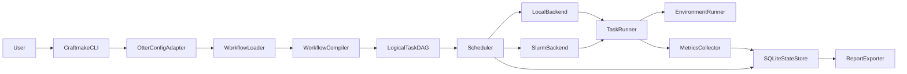

# Craftmake 独立工作流执行器实施计划

> **执行状态更新（2026-09-05）：** 独立 Craftmake CLI 的核心控制面已接近首版完成；父项目 Gate 6 已接受 RRBS、RNA-seq、BS-PDX 与 RNA-PDX 的有界 executor parity，Gate A–D corrected evidence 与 Methx/Methrix parity 也已完成。fresh seven-input legacy-equivalent matrix 未执行；生产数据扩展、representative 20-cell matrix、scale 与 clean-host release gate，以及 WGBS 和额外 Snakemake recovery 均为 deferred、non-blocking extensions。可审计的当前基准资产保存在 [`doc/benchmarks/`](benchmarks/README.md)。

## 1. 文档状态

- 状态：实施中
- 最后更新：2026-09-05
- 目标项目：`/home/fallingstar10/shire/xdxtools/craftmake`
- 主要语言：Go
- 首要使用场景：执行和管理 `otter` 的 RRBS、WGBS、BS-seq、RNA-seq 与 PDX 工作流
- 首版定位：独立 runner CLI，不负责创建 `otter` 项目、不负责扫描 FASTQ、不负责生成领域配置
- 当前实施范围：阶段 1–7，以及独立 CLI 的打包发布工作
- 2026-07-25 命名硬切换：workflow DSL 仅接受 `on.otter`，默认环境为 `otter-core`，工具入口为 `fastqcx`、`xenofilx`、`pairbam`、`seq2mat`、`matsrun`、`methx`，Fastqcx 输出目录后缀为 `_fastqcx`，Methx 可执行覆盖变量为 `METHX`；不提供旧键、旧命令、旧任务标识、旧输出目录后缀或旧环境变量兼容别名
- 历史证据边界：2026-07-25 前冻结的日志、checksum 与绝对路径可能记录旧命名，它们只用于证明当时的验收结果，不是当前默认；FastQC 外部协议及 `fastqc_data.txt` 文件名、`methrix_data.h5` 等科学数据名继续保留
- Deferred：阶段 8 `otter` 子进程集成；Craftmake 二进制内的 Snakemake interpreter 仍不实施。父项目中的 explicit Snakemake compatibility executor 已独立完成有界 parity，详见本文开头的 2026-08-13 状态更新。
- 当前里程碑：M4 最小真实 Slurm 纵向验收、BeaverBS synthetic 五阶段、活动 Slurm 作业断连后 `resume`、Controller 结构化日志、显式 worker 动态补位、pending timeout、submit-limit 退避和 Paracloud Gate 0 工具基线均已通过；BeaverPDX Gate 1 synthetic human/mouse 五阶段真实工具链、五阶段全缓存 replay、选择性失效和运行中 Controller 中断/`resume` 均已通过。当前统一策略是四类 workflow 均只先做公开真实数据的确定性小样本验收：BeaverBS 与 BeaverPDX 复用既有结果并补齐来源记录，随后完成 BeaverRNA 和 BeaverRNASEQPDX；生产规模和统一多组学验收全部后移，不作为当前 workflow gate
- 整体估算：执行器核心约 97%；首版发布范围约 96%

### 1.1 阶段状态总览

| 阶段 | 状态 | 估算完成度 | 当前结论 |
|---|---|---:|---|
| 阶段 1：工程骨架、CLI 与协议 | 接近完成 | 98% | CLI、固定退出码、信号取消、二进制级退出码契约、Controller 结构化日志、manifest/result/event 兼容性边界和 result 时间字段策略均已完成 |
| 阶段 2：Otter Adapter 与 YAML Compiler | 大部分完成 | 85% | DSL、模板、维度展开、DAG、资源校验、路径规范化和提交前输入预检已实现；真实配置和领域 fixture 随生产验收继续扩充 |
| 阶段 3：SQLite、Runtime 与 Local Backend | 接近完成 | 95% | Local global/sample/batch、状态、日志、输出校验、可靠取消、Controller 恢复和真实 orphan 进程恢复集成测试已完成 |
| 阶段 4：Fingerprint、Resume 与 Local 指标 | 接近完成 | 95% | 缓存、artifact 校验、输入/输出变更失效、失效原因持久化/展示、GNU time、gzip、CSV、运行中 source run 对账和 resume CLI 集成测试已完成 |
| 阶段 5：迁移 BeaverBS 与 BeaverPDX | 接近完成 | 98% | 两类 workflow 各五个 phase 均完成 YAML、编译和 Local 纵向验收；BeaverBS 与 BeaverPDX 均完成 synthetic 五阶段真实工具/Slurm 链路和全缓存 replay，BeaverPDX 另已完成选择性失效与运行中 Controller 恢复验收；公开真实数据候选已经登记，当前只补充确定性小样本验收，不执行生产规模验收 |
| 阶段 6：迁移 BeaverRNA 与 BeaverRNASEQPDX | 大部分完成 | 90% | BeaverRNA 三个 phase 与 BeaverRNASEQPDX 五个 phase 均已完成 YAML、编译测试和 Local 假工具纵向验收；下一步只做已登记公开数据的真实工具与 Slurm 小样本验收 |
| 阶段 7：Slurm Controller、Batch srun 与 Sacct | 接近完成 | 98% | Paracloud `amd_512` 已验证真实并发 slot、终态动态补位、pending reason/timeout/scancel、受控 submit-limit 退避后真实重投、sbatch/srun/sacct、断连后 `resume` 和 accounting 延迟补采；仍缺更高负载控制面验收与两个 RNA workflow 的小样本真实集群验收 |
| 阶段 8：Otter 集成 | Deferred | 0% | 首版不实施 |
| 阶段 9：Snakemake Compatibility | 父项目 Gate 6 已有 accepted bounded evidence；Craftmake 内嵌解释器 Deferred | — | 显式 compatibility executor 的 RRBS、RNA-seq、BS-PDX 与 RNA-PDX parity 已接受；后续 Snakemake interruption/recovery、representative/scale 与退场决策均为 deferred extensions |
| 阶段 10：独立 CLI 打包与发布 | 接近完成 | 95% | Makefile 安装/卸载、Linux amd64/arm64 静态发布包、checksums、解包后 catalog 路由 smoke、CI、release workflow 和首版 README 已完成；正式发布前仍需外部干净 Linux 与真实 Slurm 安装验收 |

### 1.2 已完成的关键能力

- `validate`、`plan`、`run`、`resume`、`status`、`logs`、`report`、`cancel`、`doctor` 与隐藏 task runner 命令。
- Versioned Workflow YAML 与 task manifest/result/event 协议；协议解码兼容最小版本和未知新增字段，拒绝未来版本，终态 result 强制 `started_at`/`finished_at` 且保证时间顺序。
- `global`、`sample`、`batch` scope，`sample`、`species` dimensions 和 `group_by`。
- 模板渲染、稳定 task ID、DAG 拓扑排序、冲突检查和 batch 资源校验。
- Local worker pool、顺序 steps、environment 继承、enva/conda/system shell。
- SQLite run/task/submission/attempt/step/metrics 状态，以及 schema v3 artifact 查询索引与迁移兼容。
- 稳定定义 fingerprint、依赖 fingerprint、输入/输出 artifact size/mtime/validation 快照、task retry、GNU time、日志压缩和 CSV 报告。
- 输入或输出 artifact 元数据变化会使缓存失效；DAG 内动态生成输入可在后续运行稳定命中缓存。
- Slurm sbatch/srun/squeue/sacct/scancel 基础执行链路、终态 result 优先恢复、运行中 result 重新接管和非阻塞指标降级。
- 显式 `--workers` submission 插槽支持动态补位；Slurm `PENDING` allocation 持续占槽，终态释放后立即补位；临时 `sbatch` submit-limit/Controller 故障使用指数退避，永久配置错误立即失败，并支持 pending reason 日志与可选 pending timeout。
- 单个 submission 超过显式 CPU/内存 admission budget 时立即标记 `submission.unschedulable`，不再无诊断地停留为 pending。
- Paracloud `amd_512` 真实 smoke：两个 sample 和一个 aggregate allocation/step 全部 `COMPLETED/0`，run 为 `succeeded: 3`，输出与 `slurm_sacct/accounting` CSV 指标通过验收。
- `--workers=2` 真实 slot 验收：两个 sample 同时占满 slot，终态释放后 aggregate 自动补位；三个 job 均 `COMPLETED/0`。
- pending timeout 真实控制链路：测试包装器在 `sbatch` 成功后 hold 两个 job，Controller 记录 `(JobHeldUser)` 并在各自持续 pending 10 秒后写入 `submission.pending_timeout`、调用 `scancel`；`sacct` 为 `CANCELLED` 且队列无残留。
- submit-limit 退避验收：受控注入一次 `QOSMaxSubmitJobPerUserLimit`，Controller 在退避期间释放 slot，另一 ready submission 动态补位；原 submission 随后重新竞争 slot 并调用真实 `sbatch`，三个 job 均 `COMPLETED/0`。
- Paracloud 已提供 `x86_64-unknown-linux-musl` static PIE `enva`；现有二进制为 ELF `ET_DYN` PIE，`ldd` 确认为 statically linked，本项目不重复构建。
- BeaverBS step1 已在 Paracloud `amd_512` 使用真实 `fastqcx 0.3.4`、`trim_galore 0.6.10` 和每端 20,000 reads 的配对 FASTQ 完成验收：三个生物工具 allocation 与 checker allocation均 `COMPLETED/0`，输出命名、gzip 完整性、FastQC 数据、trimming report、成功标记和 `slurm_sacct/accounting` CSV 指标均通过。
- BeaverBS synthetic hg38-window 纵向链路已完成真实 step2、step2-check、step3 和 step3-check：step2-check 三个 job 均 `COMPLETED/0`，MultiQC 1.19 报告包含 sample、Qualimap 和 Picard 模块；step3 使用 samtools、static `pairbam` 和 Bismark methylation extractor，coverage gzip 与 BAM quickcheck 通过；step3-check 七个任务使用真实 Methrix、Bismark report/summary 和 QCTB 成功生成 1.39 MB CpG RON、HDF5、两个有效 XLSX、HTML 报告和 success marker；完整缓存复验分别为 `cached: 3`、`cached: 1`、`cached: 7` 且未新增 job。
- step3-check 真实验收发现 Methrix 0.1.0 的生产契约与旧假工具不一致：`process` 不支持 `--annotation-dir`，主 HDF5 输出为 `methrix_data.h5`，且默认过滤非标准 FASTA contig；BeaverBS/BeaverPDX 已同步改用真实输出契约，并在默认 RON 为空时从 FASTA header 显式传入 `--contigs`，严格 fake CLI、编译测试和真实 Slurm 均通过。
- Paracloud Gate 0 工具基线已在登录节点和全新 `amd_512` allocation 通过：job `40824307` 验证 Bismark 0.25.1、STAR 2.7.11b、samtools 1.15.1、Qualimap 2.3、Picard 3.4.0、HTSeq 2.0.3、MultiQC 1.19、Trim Galore 0.6.10、`pairbam`/Xenofilx `daily-20260717`、QCTB 0.1.0、`fastqcx` 0.3.4 与 Methrix 0.1.0；`sacct` 为 `COMPLETED/0`。
- Gate 0 发现 managed environment 中 Picard wrapper 会误用继承的 base `JAVA_HOME` 并触发 `JLI_StringDup`；BeaverBS、BeaverPDX 和 BeaverRNASEQPDX 的 Picard steps 现会在可用时绑定 `${CONDA_PREFIX}/lib/jvm`。真实 job `40824319` 使用 Picard 3.4.0 处理 800 aligned reads，生成有效 metrics/PDF，`sacct` 为 `COMPLETED/0`。
- BeaverBS/BeaverPDX `methx` steps 现支持 `METHX` 显式可执行路径并保留 `methx` 默认值。真实 job `40824365` 在清空 `LD_LIBRARY_PATH`、无临时 PATH link 条件下从 1 个 contig 提取 9,893 个 CpG，处理 1 个 Bismark coverage，生成有效 HDF5 和 XLSX，`sacct` 为 `COMPLETED/0`；全局 `~/.cargo/bin/methx` 的损坏 ABI 不再是 Paracloud workflow 阻塞项。
- 真实 step3 首次运行发现 BeaverBS/BeaverPDX workflow 将 pairbam 临时输入命名为 `.bam.tmp`，违反 pairbam 的 `.bam` 后缀契约；已改为 `.tmp.bam`，并通过两个 workflow 的扩展感知 Local 回归和 BeaverBS 真实 Slurm 复验。
- BeaverBS step1 验收期间 Controller 在第三个 Slurm allocation 运行后断连；`resume` 成功采用已有 terminal result，续跑 run 缓存前三个任务并仅提交 checker，完成真实活动作业断连恢复验证。
- BeaverBS step1 完整缓存重跑为 `cached: 4`，且未新增 Slurm job。
- Slurm submission shell 兼容 Bash 4.2 `set -u` 空数组；`squeue=COMPLETING` 时可用 `sacct` 明确终态及时收口。
- `SIGINT`/`SIGTERM` 全进程组取消、持久化 `cancelled` 状态和取消竞态测试。

### 1.3 当前未完成的关键能力

- 当前父项目 Gate 6 已接受四类 workflow 的有界 executor parity、corrected Gate A–D evidence 和 Methx/Methrix parity；fresh seven-input legacy-equivalent matrix 未执行。Craftmake 本身仍不声称 production-scale biology 或 statistical-power approval，相关代表性/scale qualification 属于 deferred extensions。
- 正式发布前仍需在外部干净 Linux 环境验证安装、Local smoke、真实 Slurm smoke 和旧数据库迁移；本工作区内的 checksum、解包后二进制、自动 workflow catalog 路由和静态 ELF 检查已通过。
- 小样本验收需要目标集群上的完整 reference 和跨 phase 产物；Paracloud 账号、Slurm、真实工具环境及 static PIE `enva` 已可用，不再列为阻塞项。
- Paracloud 的全局 `~/.cargo/bin/methx` 仍缺少 `libhdf5_serial.so.103`，但 BeaverBS/BeaverPDX workflow 已支持通过 `METHX` 使用固定的 `$HOME/methx/target/release/methx`；该二进制在 `LD_LIBRARY_PATH` 清空的计算节点上通过真实输入验收。干净 Linux 发布仍需将 Methrix 及其 HDF5 依赖封装为可移植资产或受管理环境。

已从未完成清单移除的近期完成项：缓存失效原因持久化与展示、真实 Local orphan 恢复集成测试、`resume` CLI 集成测试、`report --refresh-metrics`、Controller JSONL 结构化日志和 SQLite `events` 双写、TaskEvent/TaskResult 协议边界、scheduler flag 回归测试、本地发布包验收、Paracloud workers/pending/submit-limit 控制链路、BeaverBS step2-check/step3/step3-check synthetic 真实工具验收、BeaverPDX Gate 1 选择性失效与运行中 Controller 恢复，以及独立 `enva` static PIE 构建。

### 1.4 当前实施任务

以下任务按顺序推进；只有当前任务通过验收后才进入下一项。

- [x] 修复 Local 取消时遗留 task runner 和 step 子进程的问题。
- [x] 在取消后持久化 run、submission、task 和 attempt 的 `cancelled` 状态。
- [x] 完成取消路径的单元测试、竞态检测和真实 `SIGINT` 集成测试。
- [x] 盘点 BeaverBS step1 的 phase Snakefile、当前 `rules/`、软件环境和输出路径契约。
- [x] 建立 RRBS 两样本真实配置 fixture。
- [x] 编写 `workflows/BeaverBS/step1.yaml` 初版。
- [x] 使 BeaverBS step1 通过 `validate` 与 `plan`；当前计划为 7 个 task、7 个 submission。
- [x] 建立不依赖大型生信数据的 Local 假工具 fixture，验证 sample 独立执行、全局聚合、缓存、日志和 CSV。
- [x] 增加 Adapter、Compiler 与 CLI 纵向回归测试；首次运行 `succeeded: 7`，第二次运行 `cached: 7`。
- [x] 对照真实 `fastqcx 0.3.4` 和 `trim_galore 0.6.10` 在 Paracloud `amd_512` 执行 BeaverBS step1 小型真实工具 smoke test；每端 20,000 reads 的配对 FASTQ、文件命名、gzip 输出和 FastQC/Trim Galore 契约均通过验收。
- [x] 根据迁移结果补强 otter Adapter 和 Compiler，完成配置路径规范化、sample/species 上下文路径映射和提交前输入文件预检。
- [x] 编写 `workflows/BeaverBS/step2.yaml` 初版，覆盖 Bismark、samtools、Qualimap 和 Picard GC bias。
- [x] 编写 `workflows/BeaverBS/step2-check.yaml` 初版，覆盖跨 phase sample artifact 预检、MultiQC 和 checker。
- [x] 使 BeaverBS step2 与 step2-check 通过 `validate` 与 `plan`；当前分别为 6 和 4 个 task/submission。
- [x] 建立 BeaverBS step2 与 step2-check Local 假工具纵向 fixture；首次分别 `succeeded: 6`、`succeeded: 4`，第二次分别 `cached: 6`、`cached: 4`。
- [x] 编写 `workflows/BeaverBS/step3.yaml` 初版，覆盖 name sort、`pairbam` 和 Bismark methylation extractor。
- [x] 编写 `workflows/BeaverBS/step3-check.yaml` 初版，覆盖 Methrix、Bismark report/summary、QC summary 和 checker。
- [x] 使 BeaverBS step3 与 step3-check 通过 `validate` 与 `plan`；当前分别为 2 和 9 个 task/submission。
- [x] 建立 BeaverBS step3 与 step3-check Local 假工具纵向 fixture；首次分别 `succeeded: 2`、`succeeded: 9`，第二次分别 `cached: 2`、`cached: 9`。
- [x] 在 Paracloud `amd_512` 使用 synthetic hg38-window 真实 Bismark、samtools、Qualimap、Picard、MultiQC、pairbam 和 methylation extractor 完成 BeaverBS step2、step2-check、step3；三条 phase 均完成 Slurm accounting 与全缓存复验。
- [x] 修正 BeaverBS/BeaverPDX step3 的 pairbam 临时 BAM 后缀，从 `.bam.tmp` 改为 `.tmp.bam`，并以扩展感知 fake pairbam 与 BeaverBS 真实 Slurm 复验防止回归。
- [x] 在 Paracloud `amd_512` 使用 synthetic hg38-window 跨 phase 真实产物完成 BeaverBS step3-check；七个任务使用真实 Methrix 0.1.0、Bismark report/summary 和 QCTB，HDF5、XLSX、HTML 与 success marker 均通过完整性检查，缓存复验为 `cached: 7` 且无物理提交。
- [x] 按真实 Methrix 0.1.0 契约修正 BeaverBS/BeaverPDX step3-check：移除 `--annotation-dir`，使用 `methrix_data.h5`，并为非标准 FASTA contig 增加 `--contigs` 回退；严格 Local fake、编译测试和 BeaverBS 真实 Slurm 复验均通过。
- [ ] Deferred：四类 workflow 小样本工具链统一完成后，再设计 BeaverBS/BeaverPDX 生产规模与多组学联合验收；当前不下载或运行全量 RRBS/WGBS。
- [x] 启动 BeaverPDX 五个 phase 迁移，并完成 step1 的 sample 级 Local 纵向 fixture；首次 `succeeded: 7`，第二次 `cached: 7`。
- [x] 编写 `workflows/BeaverPDX/step2.yaml`，mapping 按 `species` 分组为两个 batch allocation，每组两个 sample worker；Qualimap 与 GC bias 保持 sample × species 独立提交。
- [x] 使 BeaverPDX step2 通过 `validate` 与 `plan`；两样本、两物种生成 12 个逻辑任务和 10 个物理提交。
- [x] 建立 BeaverPDX step2 Local 假工具纵向 fixture并验证 batch 执行与缓存；首次 `succeeded: 12`，第二次 `cached: 12`。
- [x] 迁移 BeaverPDX step2-check，覆盖 sample×species step2 artifact 校验、Picard tag patch、全局 Xenofilx、逐样本 filtered BAM 校验、MultiQC 和最终 checker。
- [x] 使 BeaverPDX step2-check 通过 `validate` 与 `plan`；两样本、两物种生成 13 个 task/submission。
- [x] 建立 BeaverPDX step2-check Local 假工具纵向 fixture；首次 `succeeded: 13`，第二次 `cached: 13`。
- [x] 迁移 BeaverPDX step3，使用 Xenofilx 的 `${sample}_fixed_${graft}_Filtered.bam` 实际产物，覆盖 name sort、`pairbam` 和 Bismark methylation extractor。
- [x] 使 BeaverPDX step3 通过 `validate` 与 `plan`；两样本生成 2 个 task/submission。
- [x] 建立 BeaverPDX step3 Local 假工具纵向 fixture；首次 `succeeded: 2`，第二次 `cached: 2`。
- [x] 迁移 BeaverPDX step3-check，覆盖 sample-level step3 artifact、sample×species mapping QC、Methrix、graft Bismark report/summary、QC summary 和最终 checker。
- [x] 使 BeaverPDX step3-check 通过 `validate` 与 `plan`；两样本、两物种生成 13 个 task/submission。
- [x] 建立 BeaverPDX step3-check Local 假工具纵向 fixture；首次 `succeeded: 13`，第二次 `cached: 13`。
- [x] 在 Paracloud `amd_512` 完成 BeaverPDX synthetic human/mouse 五阶段真实工具链与全缓存 replay；真实 Xenofilx filtered BAM、Methrix、QCTB、五阶段 accounting、最终空队列和 checksums 均已冻结到 v5 evidence。
- [x] 在独立副本中完成 BeaverPDX 选择性失效和运行中 Controller 中断/`resume` 验收；选择性 run 为 `cached: 11, succeeded: 2`，恢复 continuation 为 `cached: 12, succeeded: 1`，均无非预期重投。
- [ ] Deferred：四类 workflow 小样本工具链统一完成后，再使用完整双物种项目执行 BeaverPDX 生产规模验收；当前不下载或运行全量 PDX WGBS。
- [x] 盘点 BeaverRNA step1 的专用 Snakefile 与 `fastqcx`、`trim_galore`、checker 输出契约。
- [x] 编写 `workflows/BeaverRNA/step1.yaml`，保留 RNA trimming 的 `c1/c2/t1/t2` 参数并覆盖前后 FastQC 与全局 checker。
- [x] 使 BeaverRNA step1 通过 `validate` 与 `plan`；两样本生成 7 个 task/submission。
- [x] 建立 BeaverRNA step1 Local 假工具纵向 fixture；首次 `succeeded: 7`，第二次 `cached: 7`。
- [x] 迁移 BeaverRNA step2，覆盖 STAR mapping、samtools 排序索引、Qualimap 与 HTSeq；矩阵、RNA splicing、QC summary 和 checker 保留在原始 `step2-check` phase。
- [x] 使 BeaverRNA step2 通过 `validate` 与 `plan`；两样本、单物种生成 6 个 task/submission。
- [x] 建立 BeaverRNA step2 Local 假工具纵向 fixture；首次 `succeeded: 6`，第二次 `cached: 6`。
- [x] 迁移 BeaverRNA step2-check，覆盖跨 phase artifact 校验、表达矩阵、RNA splicing、QC summary 和最终 checker。
- [x] 为全局 RNA 任务增加规范化标量 `reference.rnaseq.primary_gtf` 与 `primary_reference`，避免列表配置在无 species 维度任务中无法渲染。
- [x] 使 BeaverRNA step2-check 通过 `validate` 与 `plan`；两样本、单物种生成 6 个 task/submission。
- [x] 建立 BeaverRNA step2-check Local 假工具纵向 fixture；首次 `succeeded: 6`，第二次 `cached: 6`。
- [x] 启动 BeaverRNASEQPDX 五个 phase 迁移，完成 step1 的 sample 级 FastQC、trimming 和 checker。
- [x] 为双物种 RNA 配置增加规范化标量 `reference.rnaseq.graft_*` 与 `host_*`，供后续全局 PDX RNA 任务使用。
- [x] 使 BeaverRNASEQPDX step1 通过 `validate` 与 `plan`；两样本生成 7 个 task/submission。
- [x] 建立 BeaverRNASEQPDX step1 Local 假工具纵向 fixture；首次 `succeeded: 7`，第二次 `cached: 7`。
- [x] 迁移 BeaverRNASEQPDX step2，mapping 按 species 分成两个 batch allocation，每组两个 sample STAR worker；Qualimap 保持 sample×species 独立提交。
- [x] 使 BeaverRNASEQPDX step2 通过 `validate` 与 `plan`；两样本、两物种生成 8 个逻辑任务和 6 个物理提交。
- [x] 建立 BeaverRNASEQPDX step2 Local 假工具纵向 fixture；首次 `succeeded: 8`，第二次 `cached: 8`。
- [x] 迁移 BeaverRNASEQPDX step2-check，覆盖 sample×species artifact 校验、RNA 模式 Picard tag patch、全局 Xenofilx、逐样本 filtered BAM 校验和最终 checker。
- [x] 使 BeaverRNASEQPDX step2-check 通过 `validate` 与 `plan`；两样本、两物种生成 12 个 task/submission。
- [x] 建立 BeaverRNASEQPDX step2-check Local 假工具纵向 fixture；首次 `succeeded: 12`，第二次 `cached: 12`。
- [x] 迁移 BeaverRNASEQPDX step3，覆盖 filtered graft BAM 的 HTSeq count 与 PDX RNA splicing。
- [x] 使 BeaverRNASEQPDX step3 通过 `validate` 与 `plan`；两样本生成 3 个 task/submission。
- [x] 建立 BeaverRNASEQPDX step3 Local 假工具纵向 fixture；首次 `succeeded: 3`，第二次 `cached: 3`。
- [x] 迁移 BeaverRNASEQPDX step3-check，覆盖 sample artifact、sample×species mapping QC、表达矩阵、QC summary 和最终 checker。
- [x] 使 BeaverRNASEQPDX step3-check 通过 `validate` 与 `plan`；两样本、两物种生成 9 个 task/submission。
- [x] 建立 BeaverRNASEQPDX step3-check Local 假工具纵向 fixture；首次 `succeeded: 9`，第二次 `cached: 9`。
- [ ] 使用已登记的公开真实数据确定性小样本，在 Paracloud 完成 BeaverRNA 和 BeaverRNASEQPDX 的真实工具/Slurm 验收；不运行全量 RNA-seq，不把 `group_levels: 1` 的结果表述为统计型 splicing 验收。

### 1.5 后续验收路线图

后续工作按以下 gate 顺序执行。每个 gate 必须使用新的隔离项目目录、state directory 和 run ID；不得覆盖已有验收产物，不得把 fake-tool 或 synthetic 数据表述为公开真实数据验收，也不得把真实小样本表述为 production-scale 或生物学验收。每次真实 Slurm 验收均需同时保存 `craftmake status --verbose`、Controller JSONL、SQLite state、CSV report、关键输出完整性结果和 `sacct` 终态。

#### Gate 0：固定生产工具基线（Paracloud 已通过）

目标：在继续 PDX/RNA 验收前，消除工具路径和动态库的不确定性。

状态与证据：

- 隔离证据目录：`$HOME/craftmake-gate0-tool-baseline-20260724`；保留登录节点 probe、计算节点 probe、提交 manifest、Slurm stdout/stderr、`sacct`、settled `squeue` 和关键产物 checksum。
- 登录节点和 job `40824307` 使用 `otter-core` 固定了工具路径和版本：Bismark 0.25.1、STAR 2.7.11b、samtools 1.15.1、Qualimap 2.3、Picard 3.4.0、HTSeq 2.0.3、MultiQC 1.19、Trim Galore 0.6.10、`pairbam`/Xenofilx `daily-20260717`、QCTB 0.1.0、`fastqcx` 0.3.4、Methrix 0.1.0、enva 0.1.0 和 Slurm 23.11.8；job 为 `COMPLETED/0`。
- 全局 `~/.cargo/bin/methx` 确认依赖缺失的 `libhdf5_serial.so.103`，不能作为生产入口。BeaverBS/BeaverPDX workflow 已支持 `METHX`；Paracloud 固定为 `$HOME/methx/target/release/methx`，SHA-256 为 `7f40fca88003b0d3bf206e0be3fe4440495c395967110bb10ba6f723a93cb03a`，RUNPATH 指向 `rust_build/lib`。
- job `40824365` 在 `LD_LIBRARY_PATH` 清空且无临时 PATH link 条件下完成真实 Methrix CpG 提取和 process：提取 9,893 个 CpG，保留 323 个有 coverage 的 CpG，生成有效 `methrix_data.h5` 和可解包 `CpG_coverage.xlsx`；`sacct` 为 `COMPLETED/0`，settled `squeue` 无残留。
- 默认 Picard wrapper 会误用 base `JAVA_HOME` 并触发 `JLI_StringDup`。四处 Picard workflow invocation 已在当前 `${CONDA_PREFIX}/lib/jvm/bin/java` 存在时绑定 `JAVA_HOME`；job `40824319` 使用 Picard 3.4.0 处理真实小型 BAM，生成有效 metrics、summary 和 PDF，`sacct` 为 `COMPLETED/0`，settled `squeue` 无残留。
- compiler 和 Local integration tests 已覆盖 Picard Java 绑定及 `METHX` 覆盖；完整 `make check` 通过。

通过结论：

- Paracloud Gate 0 已通过；继续 Gate 1 时必须在启动 `craftmake` 前设置固定的 `METHX`，不得恢复临时 `tool-bin` link。
- clean Linux 发布仍需将 Methrix 二进制和 HDF5 依赖封装为可移植发布资产或独立 managed environment；该项保留在 Gate 5，不阻塞 Paracloud Gate 1。

#### Gate 1：BeaverPDX synthetic 双物种真实工具链（已通过）

目标：用可控的小型 human/mouse 数据打通 BeaverPDX 五个 phase，优先暴露工具参数、文件命名和跨 phase 契约问题。

状态与证据：

- 隔离根目录：`$HOME/craftmake-gate1-beaverpdx-20260724-01`；最终冻结链使用 `project-v5`、`state-v5`、`evidence-v5` 和 `workflows-v5`，历史 v1–v4 失败证据均保留且未覆盖。
- 五个 phase 首次成功状态分别为 `succeeded: 7`、`12`、`13`、`2`，以及 step3-check 最终修复 run 的 `cached: 11, succeeded: 2`。真实 Xenofilx 对 sample-g/sample-h 分别产生 158/160 条 mapped graft alignments；两个 BAM 与 BAI 非空并通过 `samtools quickcheck`。
- Methrix 从两个 synthetic human contig 提取 5,239 个 CpG，生成有效 RON、HDF5 和可解包 `CpG_coverage.xlsx`；QCTB 作为未修改的外部工具处理两个样本，stderr 为空、exit 0，并生成 6.2 KiB 的有效 `qc_summary.xlsx`。PDX task 仅生成临时兼容 YAML，不改原项目 config，也不改 QCTB。
- 五阶段全缓存 replay 分别为 `cached: 7`、`12`、`13`、`2`、`13`，各 Controller 均为 0 个 `backend_job_id`，没有新物理 Slurm submission。
- 最终 QCTB/checker jobs `40828160`、`40828162` 均为 `COMPLETED|0:0`；后者曾在 `sacct` 终态后短暂停留 `COMPLETING`，最终 `squeue` 为空。完整状态、accounting 和 checksums 已冻结到 `evidence-v5/gate1-v5-final-summary.txt`。
- 最新 workflow revision SHA-256 为 `8a005ea128f1b9025425174707c696b7dabc13037f6f2980c7710f82e239d405`，验收 binary SHA-256 为 `a3d0f4e49757f3efe021f24d6a5e880e72fe5845e4144a5a2326d13418a385da`；本地完整 `make check` 通过。
- 选择性失效使用独立的 `project-selective-v1`、`state-selective-v1` 和 `evidence-selective-v1`。新路径首次建立 13-task 缓存基线后，全缓存 replay 为 `cached: 13`、零提交；只修改 `qc_summary.xlsx` 的 mtime、保持内容 checksum 不变后，run `gate1-selective-qctb-output-v1` 为 `cached: 11, succeeded: 2`，仅提交 QCTB job `40828342` 和 checker job `40828343`。两者均为 `COMPLETED|0:0`，最终队列为空。冻结汇总为 `evidence-selective-v1/gate1-selective-final-summary.txt`，SHA-256 为 `1f3de9fda30967b46bd5d82dc9e74f14c12ba67d8294ad9e2d5b05997e635faf`。
- Controller 恢复使用独立的 `project-resume-v1`、`state-resume-v1` 和 `evidence-resume-v1`。PTY 断连后 Controller 进程数为 0，source run `gate1-resume-source-v2` 保持 `cached: 11, running: 1, pending: 1`，原 QCTB job `40828392` 仍在运行。`resume` 接纳其 terminal result，未重复提交 QCTB；continuation `983423a0-4531-4c7b-bcb4-bf1127db1780` 为 `cached: 12, succeeded: 1`，只提交 checker job `40828398`，最终 replay 为 `cached: 13`。两个接受链 job 均为 `COMPLETED|0:0` 且最终队列为空。冻结汇总为 `evidence-resume-v1/gate1-resume-final-summary.txt`，SHA-256 为 `9c31d4f81e59c1c91fd3f6a6026f4e269fc0adc8a42066830a7d00511cfbd148`。

已完成执行项：

- [x] 构造同一批配对 FASTQ，使 human 和 mouse reference 均产生可验证的 mapping 结果。
- [x] 运行 step1、step2、step2-check、step3、step3-check，并隔离保存每轮成功/失败证据。
- [x] 验证 sample × species batch submission、Picard tag patch、真实 Xenofilx、graft/host filtered BAM、`.tmp.bam` pairbam 输入、methylation extraction、Methrix、Bismark report/summary、MultiQC 和 QCTB。
- [x] 每个 phase 完成一次全缓存重跑并证明零新物理 submission。

- [x] 在新的 project/state 副本中仅修改 QCTB XLSX 的 artifact mtime，验证 11 个无关任务保持 cached，仅 QCTB 和下游 checker 重算；冻结的 v5 state 未写入。
- [x] 在新的隔离运行中通过 PTY 断连终止 Controller，验证原 QCTB Slurm job 保持运行；`resume` 接纳其 terminal result，不重复 `sbatch`，continuation 只提交未完成 checker。

通过结论：

- Gate 1 已通过并关闭；五个 phase 均为 `succeeded`，缓存重跑没有新增物理 submission。
- 选择性失效严格限制为 QCTB 与其 downstream checker；Controller 恢复链复用原 QCTB job，只提交尚未执行的 checker，最终全缓存 replay 为 `cached: 13`。
- BAM 通过 `samtools quickcheck`，gzip 通过 `gzip -t`，XLSX 可作为 ZIP 打开，HDF5 和 HTML 非空且包含预期 sample/species。
- 所有接受链 Slurm job 在 `sacct` 中均为 `COMPLETED|0:0`，最终 `squeue` 为空。

#### 真实数据候选登记与统一小样本规则

当前四类 workflow 均只进行真实来源的小样本工具链验收。下表记录的是可用于验收的公开原始数据候选及其 primary metadata；候选原始 run 的完整规模只用于 provenance，不代表将下载或运行全部数据。

| Workflow | 公开数据与来源 | 物种/模型 | 文库与原始规模 | 当前小样本选择 | 状态 |
|---|---|---|---|---|---|
| BeaverBS | [SRP547218 / PRJNA1190049](https://www.ncbi.nlm.nih.gov/sra/?term=SRP547218) | Homo sapiens，PBMC | paired-end RRBS/RRoxBS，HiSeq X Ten，候选 run 约 27–29M read pairs、2.8–3.0 GiB SRA Lite | `SRR31480456`、`SRR31480477`；每个 run 确定性保留前 1,000,000 对 reads | NCBI run metadata 已核验；待下载小样本并执行五 phase |
| BeaverPDX | [GSE227086 / SRP426633 / PRJNA943199](https://www.ncbi.nlm.nih.gov/geo/query/acc.cgi?acc=GSE227086) | Homo sapiens prostate cancer PDX；计算时按 human graft + mouse host | paired-end 30× WGBS，HiSeq 2500；7 个 run，每个约 387–509M read pairs、40–53 GiB SRA | `SRR23802966`、`SRR23802967`；每个 run 确定性保留前 1,000,000 对 reads | NCBI GEO/SRA metadata 已核验；全量数据不下载；既有 synthetic PDX Gate 1 结果继续保留但不冒充真实数据验收 |
| BeaverRNA | [GSE124696 / SRP175361 / PRJNA513077](https://www.ncbi.nlm.nih.gov/sra/?term=SRP175361) | Mus musculus，MLL-AF9 AML | paired-end RNA-seq，NextSeq 500；16 个 run，每个约 24–32M read pairs、1.4–2.3 GiB SRA Lite | `SRR8397559`、`SRR8397560`；每个 run 确定性保留前 1,000,000 对 reads | NCBI GEO/SRA metadata 已核验；优先作为下一条真实 Slurm 验收链 |
| BeaverRNASEQPDX | [GSE278757 / SRP536524 / PRJNA1168601](https://www.ncbi.nlm.nih.gov/geo/query/acc.cgi?acc=GSE278757) | Homo sapiens PDAC PDX，植入 NSG mouse；计算时按 human graft + mouse host | paired-end RNA-seq，NovaSeq 6000；所选 run 约 39–42M read pairs、2.3–2.5 GiB SRA Lite | `SRR30880970`、`SRR30880971`；每个 run 确定性保留前 1,000,000 对 reads | SRA run metadata 标为 public/static-data-available；GEO series 同时声明因隐私未直接上传 raw FASTQ，故下载前必须以 `prefetch`/`fasterq-dump` 做可访问性 preflight；不可访问时更换公开 PDX RNA 候选，不绕过访问控制 |

统一取样与证据规则：

- 原始 accession 不变；先保存 NCBI run metadata、download URL/hash（若提供）、下载时间、原始 spots/bases/size，再生成小样本。
- 使用 `fasterq-dump --split-files` 或等价受控导出后，以配对一致的方式确定性保留每个候选 run 的前 1,000,000 对 reads；记录完整导出 FASTQ checksum、抽样 FASTQ checksum、read-pair count、read length 和 `gzip -t` 结果。不得把已有 synthetic FASTQ 标为公开真实数据。
- 每个 workflow 默认两个真实 run。若 PDX 小样本中的 host 或 graft reads 不足以覆盖 Xenofilx 契约，可按 `1M -> 2M -> 5M` read pairs 有界增加，必须记录触发原因和最终 read count；仍属于小样本验收。
- 小样本只验证真实工具可启动、参数与文件命名契约、跨 phase 产物、DAG/Slurm 调度、缓存、选择性失效、取消和 `resume`。它不证明原始队列吞吐、生产资源估算、完整生物学覆盖度、差异分析或统计功效。
- BeaverRNA 和 BeaverRNASEQPDX 当前均设置 `metadata.group_levels: 1`，splicing 明确产出 `RNASplicing_NOTRUN`；统计型 splicing 留到未来有足够分组和重复的统一多组学验收。
- 每条验收链必须使用唯一 project/state/evidence/workflow 目录和 run ID，保留 SQLite、Controller JSONL、`status --verbose`、report、`sacct`、最终空 `squeue` 以及领域文件完整性结果；不得覆盖历史 evidence。

#### Gate 2：四类 workflow 真实小样本验收（当前范围）

目标：只使用上表登记的公开真实数据小样本，完成四类 workflow 的真实工具和 Slurm 文件契约验收；不执行任何 workflow 的全量或 production-scale 数据。

执行项：

- BeaverBS：用登记的 human RRBS 小样本复核 step1–step3-check，验证 Bismark、samtools、Qualimap、Picard、Methrix、QCTB 和 checker；既有 synthetic 结果作为补充回归证据。
- BeaverPDX：用登记的 prostate PDX WGBS 小样本复核 human/mouse mapping、Picard tag patch、Xenofilx、methylation extraction、Methrix 和 QCTB；完整 30× runs 不下载。
- BeaverRNA：用登记的 mouse RNA-seq 小样本验证 FQC、Trim Galore、STAR、samtools、Qualimap、HTSeq、表达矩阵、QCTB 和 checker；单组模式不运行统计型 splicing。
- BeaverRNASEQPDX：通过 SRA 可访问性 preflight 后，用登记的 PDAC PDX RNA-seq 小样本验证双物种 STAR batch、Picard tag patch、RNA Xenofilx、filtered BAM、HTSeq、表达矩阵、QCTB 和 checker；单组模式不运行统计型 splicing。
- 每个 workflow 执行全缓存 replay，并至少覆盖一次与现有风险匹配的局部失效或 Controller `resume`；已在相同链路充分证明的调度能力可引用冻结证据，不重复制造无意义的大数据负载。

通过标准：

- 所有适用 phase 的真实 Slurm run 成功，BAM、BAI、count、matrix、coverage、HDF5、XLSX、HTML 和 success marker 按 workflow 实际产物完成结构与样本完整性检查。
- 每个 run 的公开来源、抽样过程和 checksum 可追溯；synthetic、真实小样本和未来 production-scale 标签严格分开。
- `sacct` 终态、Controller/SQLite 状态一致，接受链最终 `squeue` 为空；缓存 replay 不产生新物理 submission。

#### Gate 3：统一多组学与生产规模验收（Deferred）

目标：仅在四类 workflow 的真实小样本工具链全部通过且工具/参考资产统一后，再设计跨甲基化与 RNA 的多组学 production-scale 验收。

当前约束：

- Gate 3 当前不启动、不下载全量数据，也不作为 Gate 2 或首轮 workflow 工具契约通过的前置条件。
- 冻结候选可继续保留，例如 BeaverPDX `GSE227086 / PRJNA943199`；最终 production 数据集、样本分组、重复数、资源预算和生物学比对标准需在单独验收设计中确认。
- 将分别报告小样本工具正确性、调度/恢复正确性、生产吞吐与资源上限、生物学结果一致性；任一层的通过结论不得替代另一层。

未来执行项：

- 选择具备授权、足够 biological replicates 和可复现 metadata 的多组学 cohort，冻结 accession、reference build、sample sheet 和预期比较。
- 记录每个 phase 的任务数、submission 数、wall time、MaxRSS、pending、重试和失败恢复；验证多样本并发、worker slots 和动态补位。
- 对关键生物学输出与可信基线做数量级、结构和统计结果比对，并单独形成 production evidence 与已知限制清单。

#### Gate 4：Slurm 中等负载与失败矩阵

目标：将已通过的控制链路从功能 smoke 提升到中等负载和常见失败状态验收。

执行项：

- 以 50 至 200 个 ready submission 验证 `--workers` 上限、动态补位、Controller 内存和 SQLite 写入稳定性。
- 重复注入多次 submit-limit 和 Controller 暂时不可用，确认退避期间 slot 释放且最大 backoff 生效。
- 验证长时间 `PENDING`、pending timeout、取消竞态、accounting 延迟，以及 `OUT_OF_MEMORY`、`TIMEOUT`、`NODE_FAIL`、`PREEMPTED` 等可获得的 Slurm 终态映射。
- 在 Controller 进程退出或主机重启后执行 `resume`，确认无重复提交和无孤立 job。

通过标准：

- 不超过配置的 submission slots，不出现无诊断永久 pending。
- 每个失败状态有明确 Controller event、SQLite 状态、退出分类和可执行恢复路径。
- 验收结束后队列无残留，状态库可生成完整报告。

#### Gate 5：干净 Linux、数据库迁移与发布候选

目标：证明 release archive 可脱离源码和开发环境安装、升级和运行。

执行项：

- 在一台干净 Linux 主机解包 amd64 release，校验 checksum、静态 ELF、`doctor`、catalog routing、Local smoke、状态目录和报告。
- 在可用的第二平台或交叉环境复验 arm64 archive 的结构和启动行为。
- 使用真实旧版本 state database 执行迁移，验证旧 run、logs、reports、artifacts 和 cache 可读，迁移幂等且失败时保留原库。
- 在安装后的 catalog 上执行最小真实 Slurm smoke，确认不依赖源码目录或 Go toolchain。
- 固定 release version，生成最终 archive、checksums、release notes、支持平台和已知限制。

通过标准：

- clean-host 安装、Local、迁移和 Slurm smoke 全部通过。
- CI 下载的 release artifact 与本地 release gate 结果一致。
- Gate 0 至 Gate 5 的阻塞问题已关闭或作为明确的非阻塞已知限制进入 release notes。

#### 验收证据最小集合

每次验收至少保留：

- workflow、config、craftmake version/commit、工具版本和 reference identity。
- 唯一 project directory、state directory、run ID 和 Controller JSONL 路径。
- `validate`、`plan`、首次 run、缓存 run、必要的失效或 resume run 输出。
- `status --verbose`、`report --refresh-metrics` 及其 CSV。
- Slurm job ID、`sacct` state/exit code/elapsed/MaxRSS 和最终 `squeue` 检查。
- BAM、gzip、HDF5、XLSX、HTML、matrix/count 等与该 workflow 对应的完整性检查。
- 失败时的 task manifest、result、step script、stdout/stderr、修复和回归测试。

本文档是 `craftmake` 的实施依据。首版不尝试实现 Snakemake 解释器，也不追求完整 GitHub Actions 兼容。

---

## 2. 背景与目标

现有 `otter` 已经具备以下能力：

- Go CLI 与项目配置加载
- FASTQ 扫描及样本配对
- RRBS/WGBS/BSSEQ/RNASEQ/PDX 工作流选择
- step1/step2/step3 与 checker 编排
- local 与 Slurm 执行入口
- 基于 step 的状态与恢复
- 通过 Snakemake 执行 `.snakemake` 和 `.smk` 资产

当前限制主要来自 Snakemake 执行层：

- 工作流依赖 Python/Snakemake 运行环境。
- 状态和恢复主要停留在 step 粒度。
- Local 与 Slurm 的任务生命周期模型不统一。
- 任务 CPU、内存、I/O、日志和执行时间缺乏统一记录。
- 大量规则使用 Python 表达式、`lambda wildcards`、`expand(...)` 和深层配置索引，无法通过简单文本解析替换。

`craftmake` 的目标是提供一个独立、可复用、单二进制的原生工作流执行器：

1. 读取 GitHub Actions 风格的声明式 YAML。
2. 读取现有 `otter config.yaml`。
3. 编译每个 phase 的逻辑任务 DAG。
4. 在 Local 或 Slurm 上调度 global、sample 和 batch 任务。
5. 提供任务级缓存、恢复、状态、日志和资源指标。
6. 保持现有生信工具与输出路径契约，不把工具参数硬编码进 Go。

---

## 3. 范围

### 3.1 首版范围

首版包括：

- 独立 `craftmake` CLI。
- Workflow YAML 校验、编译和计划展示。
- 固定的 `sample`、`species` 数据维度。
- `global`、`sample`、`batch` 三种提交粒度。
- job 内多个顺序 step。
- workflow/job/step 三级软件环境继承。
- Local backend。
- Slurm controller backend。
- Batch worker 独立 `srun`。
- SQLite 状态和运行历史。
- Fingerprint 缓存。
- 任务级恢复。
- stdout/stderr 和程序日志登记。
- 任务 CPU、内存、I/O 和执行时间采集。
- CSV 报告。
- BeaverBS、BeaverPDX、BeaverRNA、BeaverRNASEQPDX 当前 phase 工作流迁移。
- 单独打包和发布 `craftmake` 二进制。

### 3.2 Deferred：阶段 8

暂不实施 `otter` 对 `craftmake` 的子进程集成，包括：

- 不修改 `otter run`。
- 不增加 `otter --executor native|snakemake`。
- 不建立 `otter` 与 `craftmake` 的 JSONL 事件转发。
- 不改变 `otter` 当前 Snakemake 默认执行路径。

`craftmake` 首版由用户直接调用，但必须能够独立读取 `otter config.yaml`。

### 3.3 Deferred：阶段 9

暂不实施完整 Snakemake parity，包括：

- 不要求自动比较 Snakemake DAG 与 craftmake DAG。
- 不要求 native/Snakemake 双路径执行同一 fixture。
- 不要求以 parity 结果决定 `otter` 默认执行器。

工作流迁移阶段仍需做内部输出契约测试，但不建立正式双执行器验收系统。

### 3.4 明确不做

首版不包括：

- `.smk` 或 `.snakemake` 解释器。
- 通用 Snakemake 兼容层。
- 完整 GitHub Actions schema 或 runner。
- `strategy.matrix`。
- `uses`、reusable workflows、services、secrets marketplace。
- 任意 Python、Starlark 或用户自定义表达式执行。
- 跨 phase 全局 DAG。
- Kubernetes backend。
- SSH backend。
- 容器 backend。
- Prometheus、OpenTelemetry 或实时 Web UI。
- 高频 CPU/内存/I/O 时间序列。
- 强制 cgroup v2。
- `rules_legacy/` 与 `.depress/` 迁移。
- FASTQ/BAM 默认内容哈希。

---

## 4. 核心设计决策

### 4.1 使用 Go

选择 Go 的原因：

- 适合构建静态单二进制 CLI。
- `otter` 主项目已经使用 Go，未来集成成本较低。
- Local worker pool、Slurm controller 和进程管理适合 Go 并发模型。
- 工作流调度是控制面工作，不是需要 Rust 性能优势的计算热点。
- Rust 仍适合作为叶子计算程序，例如 `methx` 与 `fastqc-rs`。

### 4.2 独立 CLI，而不是直接嵌入 otter

`craftmake` 独立负责：

- validate
- plan
- run
- resume
- status
- logs
- report
- cancel
- doctor

`otter` 继续负责：

- 项目创建
- FASTQ 扫描与配对
- 领域配置生成
- 参考文件配置
- 用户空间管理

这种边界避免把通用调度、状态和可观测性逻辑继续堆积在 `otter/cmd/run.go` 中。

### 4.3 每个 phase 独立 DAG

首版按现有 phase 边界编译：

- `step1`
- `step2`
- `step2-check`
- `step3`
- `step3-check`

不实现跨 phase 全局 DAG。用户或上层系统按顺序运行 phase。

### 4.4 Job 是主要调度单位

YAML 中：

- `job` 是 DAG 节点定义。
- job 展开后形成一个或多个逻辑任务实例。
- job 是缓存和恢复的主要单位。
- job 是资源声明单位。
- job 内 `steps` 顺序执行。
- step 可以切换软件环境。

### 4.5 提交粒度与数据维度分离

- `scope` 控制物理提交方式。
- `dimensions` 控制逻辑任务的数据展开。
- `group_by` 控制 batch allocation 的分组。

三种 `scope`：

- `global`：整个 job 只生成一个逻辑任务并提交一次。
- `sample`：每个逻辑实例独立提交；通常每个 sample 或 sample × species 一个提交。
- `batch`：多个逻辑实例共用一个 allocation，由 allocation 内 worker pool 并行执行。

固定数据维度：

- `sample`
- `species`

---

## 5. 总体架构



### 5.1 主要层级

1. CLI 层：命令、参数、退出码和用户输出。
2. Adapter 层：把 `otter config.yaml` 规范化为 craftmake runtime context。
3. Spec 层：Workflow YAML 数据模型和 schema 版本。
4. Compiler 层：展开任务实例、渲染模板、推导 DAG、校验资源。
5. Scheduler 层：ready queue、缓存、失败阻断、并发与恢复。
6. Backend 层：Local 和 Slurm 的提交、轮询与取消。
7. Runtime 层：顺序执行 steps、切换环境、验证输出。
8. Store 层：SQLite 状态、attempt、指标、artifact 和事件。
9. Metrics 层：GNU time 和 Slurm sacct。
10. Report 层：status、logs 和 CSV 导出。

---

## 6. CLI 设计

### 6.1 用户命令

```bash
craftmake validate \
  --workflow inst/workflows/BeaverBS/step2.yaml \
  --config project/config/config.yaml
```

```bash
craftmake plan \
  --workflow inst/workflows/BeaverBS/step2.yaml \
  --config project/config/config.yaml \
  --format table
```

```bash
craftmake run \
  --workflow inst/workflows/BeaverBS/step2.yaml \
  --config project/config/config.yaml \
  --backend local
```

```bash
craftmake run \
  --workflow inst/workflows/BeaverPDX/step2.yaml \
  --config project/config/config.yaml \
  --backend slurm \
  --project-dir project
```

```bash
craftmake resume --run <run-id>
craftmake status --run <run-id>
craftmake logs --run <run-id> --failed
craftmake report --run <run-id> --format csv
craftmake report --run <run-id> --format csv --refresh-metrics
craftmake cancel --run <run-id>
craftmake doctor --backend slurm
```

### 6.2 隐藏内部命令

```bash
craftmake __task-runner --manifest task.json
```

该命令只用于 backend 执行版本化 task manifest，不作为普通用户接口。

### 6.3 建议全局参数

- `--project-dir`
- `--state-dir`
- `--log-level`
- `--json`
- `--no-color`
- `--version`

### 6.4 `run` 参数

- `--workflow`
- `--config`
- `--backend local|slurm`
- `--max-parallel`
- `--max-cores`
- `--max-memory`
- `--partition`
- `--dry-run`
- `--force`
- `--rerun-failed`
- `--run-id`

### 6.5 退出码

建议固定：

- `0`：成功。
- `2`：CLI 参数错误。
- `3`：配置或 Workflow YAML 校验错误。
- `4`：DAG 编译错误。
- `5`：一个或多个逻辑任务失败。
- `6`：backend 或 Slurm 控制错误。
- `7`：状态数据库错误。
- `8`：用户取消。
- `9`：内部协议或不可恢复内部错误。

---

## 7. Workflow YAML DSL

### 7.1 顶层结构

```yaml
name: BeaverBS step2
version: 1

on:
  otter:
    workflow: BeaverBS
    phase: step2
    modes: [RRBS, WGBS, BSSEQ]

defaults:
  shell: bash
  environment: otter-core
  observability:
    metrics: task
    capture_stdout: true
    capture_stderr: true
    compress_success_logs: true

jobs: {}
```

### 7.2 Job 示例

```yaml
jobs:
  bismark_mapping:
    name: Bismark mapping
    scope: sample
    dimensions: [sample, species]

    inputs:
      read1: "${{ config.output.trim_dir }}/${{ sample.id }}_val_1.fq.gz"
      read2: "${{ config.output.trim_dir }}/${{ sample.id }}_val_2.fq.gz"
      genome: "${{ species.genome_index }}"

    outputs:
      bam: "${{ config.directories.bsmap.main }}/${{ sample.id }}_${{ species.name }}.bam"
      bai: "${{ config.directories.bsmap.main }}/${{ sample.id }}_${{ species.name }}.bam.bai"

    resources:
      cores: 8
      memory: 16G
      partition: cpu

    steps:
      - name: Run Bismark
        environment: otter-core
        run: |
          bismark --genome "${{ inputs.genome }}" \
            -1 "${{ inputs.read1 }}" \
            -2 "${{ inputs.read2 }}" \
            -o "${{ runner.temp }}"

      - name: Sort BAM
        run: |
          samtools sort -@ "${{ resources.cores }}" \
            -o "${{ outputs.bam }}" \
            "${{ runner.temp }}/aligned.bam"

      - name: Index BAM
        run: |
          samtools index "${{ outputs.bam }}"
```

### 7.3 软件环境继承

优先级：

```text
step.environment
  -> job.environment
  -> defaults.environment
  -> system environment
```

`env` 保留为环境变量：

```yaml
env:
  LC_ALL: C
  TMPDIR: "${{ runner.temp }}"
```

运行时：

```text
enva run <environment> -- bash <step-script>
```

如果 `enva` 不可用，允许根据配置降级为：

```text
conda run --no-capture-output -n <environment> bash <step-script>
```

环境为空时使用系统 shell。

### 7.4 Scope 语义

#### Global

适合 MultiQC、矩阵构建和汇总：

```yaml
scope: global
dimensions: []
```

生成一个逻辑任务和一个物理提交。

#### Sample

适合单样本处理：

```yaml
scope: sample
dimensions: [sample]
```

或 PDX：

```yaml
scope: sample
dimensions: [sample, species]
```

每个逻辑实例独立提交。

#### Batch

适合在单个 allocation 中并行多个样本：

```yaml
scope: batch
dimensions: [sample]

resources:
  cores: 32
  memory: 64G

worker:
  resources:
    cores: 4
    memory: 8G
  max_parallel: 8
```

PDX 按物种分 allocation：

```yaml
scope: batch
dimensions: [sample, species]
group_by: [species]
```

生成：

- human allocation，内部并行 human 样本。
- mouse allocation，内部并行 mouse 样本。

### 7.5 Batch 资源校验

必须满足：

```text
allocation.cores >= worker.cores × effective_parallel
allocation.memory >= worker.memory × effective_parallel
```

`effective_parallel` 不超过：

- `worker.max_parallel`
- 逻辑任务实例数
- backend 全局并发限制

资源不足必须在 `validate` 或 `plan` 阶段报错。

### 7.6 模板上下文

首版固定支持：

- `config.*`
- `sample.id`
- `sample.read1`
- `sample.read2`
- `sample.index`
- `species.name`
- `species.index`
- `species.genome_fasta`
- `species.genome_index`
- `inputs.*`
- `outputs.*`
- `resources.*`
- `worker.resources.*`
- `runner.temp`
- `runner.work`
- `jobs.<job-id>.outputs.<name>`

不允许：

- 任意函数调用。
- 任意文件系统访问。
- 动态代码执行。
- 未知 context 静默返回空字符串。

所有未解析表达式都必须是编译错误。

### 7.7 DAG 推导

主要依赖文件契约：

```yaml
jobs:
  trim:
    scope: sample
    dimensions: [sample]
    outputs:
      read1: ".../${{ sample.id }}_val_1.fq.gz"

  mapping:
    scope: sample
    dimensions: [sample, species]
    inputs:
      read1: "${{ jobs.trim.outputs.read1 }}"
```

编译器建立：

```text
trim[sample=A] -> mapping[sample=A,species=human]
trim[sample=A] -> mapping[sample=A,species=mouse]
```

无文件控制依赖可使用可选 `needs`：

```yaml
needs: [prepare_reference]
```

### 7.8 编译期错误

编译器必须拒绝：

- 重复 output producer。
- 渲染后 output 路径冲突。
- DAG 循环。
- 未解析表达式。
- 引用不存在的 job/output。
- dimensions 与 context 不一致。
- `group_by` 不属于 dimensions。
- batch 未声明 worker resources。
- allocation 无法容纳至少一个 worker。
- step 缺少 `run`。
- job 没有 outputs 且也没有显式控制语义。
- task ID 不稳定或重复。

---

## 8. Otter 配置 Adapter

### 8.1 原则

- `craftmake` 不 import `otter/internal/config`。
- 不逐字复制 otter 的所有 Go struct。
- Adapter 定义版本化、面向 runtime 的规范模型。
- 对旧式 flat YAML 和当前 nested YAML 做兼容归一化。
- Adapter 只读取，不修改用户配置。

### 8.2 规范上下文

至少生成：

```text
WorkflowContext
  mode
  workflow_name
  job_id
  user_id
  pdx_mode

Samples[]
  id
  index
  read1
  read2
  adapter1
  adapter2

Species[]
  name
  index
  role
  genome_fasta
  genome_index
  rnaseq_gtf
  rnaseq_reference

Paths
  raw_dir
  trim_dir
  workflow_dir
  analysis_dir
  qc_before
  qc_after
  qc_summary
  bsmap_dir
  methylation_call_dir
  beta_matrix_dir
  sid_log_dir
```

### 8.3 样本来源

优先级建议：

1. 配置中显式 `workflow.samples`。
2. 配置中 `metadata.SIDs`。
3. 首版不主动扫描 FASTQ；如果两者都缺失，报配置错误。

FASTQ 扫描仍由 `otter` 负责。

### 8.4 Species 数组映射

将旧有的“species 数组索引对应 reference 数组索引”转换为结构化对象。编译完成后 workflow 不再使用 `index(...)` 形式查找参考路径。

---

## 9. 编译器设计

### 9.1 编译流水线

1. 读取 Workflow YAML。
2. 校验 schema version。
3. 读取并规范化 otter config。
4. 建立 sample/species context。
5. 合并 defaults、job 和 step 配置。
6. 根据 dimensions 展开逻辑任务。
7. 根据 scope/group_by 建立物理提交计划候选。
8. 渲染 inputs 与 outputs。
9. 建立 output producer 索引。
10. 解析 job output 引用。
11. 生成依赖边。
12. 渲染 step commands。
13. 校验资源和路径冲突。
14. 拓扑排序。
15. 生成稳定 task ID。
16. 生成初始 fingerprint 输入。

### 9.2 稳定 Task ID

建议格式：

```text
<workflow>/<phase>/<job>/<dimension-key-values>
```

例如：

```text
BeaverPDX/step2/bismark_mapping/sample=S01/species=human
```

Task ID 不包含：

- run ID
- 随机数
- 当前时间
- Slurm job ID

### 9.3 逻辑任务与物理提交

```text
TaskInstance
  workflow
  phase
  job_id
  dimensions
  inputs
  outputs
  steps
  resources
  fingerprint

PhysicalSubmission
  backend
  scope
  group_key
  allocation_resources
  task_instances[]
```

对应关系：

- global：一个 submission 对应一个 task。
- sample：一个 submission 对应一个 task。
- batch：一个 submission 对应多个 task。

---

## 10. Scheduler 设计

### 10.1 任务状态

```text
pending
ready
submitted
running
cached
succeeded
failed
blocked
cancelled
interrupted
```

### 10.2 Ready 条件

任务进入 ready 必须满足：

- 所有上游任务为 `succeeded` 或 `cached`。
- 输入文件存在。
- 没有被失败上游阻断。
- backend 资源允许提交。

### 10.3 失败策略

默认行为：

- 某任务失败后，其下游任务标记为 `blocked`。
- 与失败任务无依赖关系的其他分支继续执行。
- workflow 结束后统一返回失败摘要。
- 生信命令默认不自动重试。
- Slurm submit/query 等控制面瞬态错误允许内部重试。
- job 可显式声明 `max_attempts`，但默认值为 1。

### 10.4 取消

收到 SIGINT/SIGTERM：

1. 停止提交新任务。
2. 标记 controller 正在取消。
3. Local 终止子进程组。
4. Slurm 对活动 job 执行 `scancel`。
5. 更新 attempt 和 submission 状态。
6. 保存可恢复状态。

### 10.5 Resume

`resume` 时：

- 成功且 fingerprint 命中的任务标记为 cached。
- failed/interrupted 任务重新进入 pending。
- running Slurm submission 根据 job ID 尝试重新接管。
- 本地 orphan 任务标记 interrupted。
- batch 只重新生成失败或未完成 worker 的 manifest。

---

## 11. Fingerprint 与缓存

### 11.1 Fingerprint 内容

任务 fingerprint 包含：

- Workflow schema version。
- Workflow YAML digest。
- job 定义。
- dimensions。
- 渲染后的 inputs。
- 渲染后的 outputs。
- 渲染后的 step commands。
- step environment。
- job/allocation/worker resources。
- 实际引用的 config 值。
- 输入文件规范路径、size、mtime。
- 上游 producer fingerprint。
- craftmake runtime version。

### 11.2 缓存命中条件

全部满足才命中：

1. 上一次 attempt 成功。
2. fingerprint 完全相同。
3. 所有声明 outputs 存在。
4. 普通输出不是空文件。
5. marker output 显式允许为空。
6. artifact 没有被标记为损坏。

### 11.3 首版取舍

- FASTQ/BAM 不默认计算完整内容哈希。
- 输入 size/mtime 是首版可移植折中。
- 后续可增加 `--fingerprint content`。
- `--force` 跳过缓存。

---

## 12. Runtime 与 Task Manifest

### 12.1 Manifest

每个逻辑任务 attempt 使用版本化 JSON manifest，至少包含：

- protocol version
- run ID
- task ID
- attempt number
- dimensions
- backend metadata
- work directory
- temporary directory
- inputs
- outputs
- resources
- ordered steps
- environment
- env variables
- log paths
- result path

### 12.2 Step 执行

Task runner：

1. 创建 task runtime 目录。
2. 写入 manifest 副本。
3. 依次生成 step shell script。
4. 解析 step environment。
5. 捕获 stdout/stderr。
6. 写入 step started 事件。
7. 执行 step。
8. 写入 step finished 事件和退出码。
9. 任一 step 失败后停止后续 steps。
10. 验证 outputs。
11. 原子写入 task result。
12. 返回最终退出码。

### 12.3 原子结果文件

写入流程：

```text
result.json.tmp -> fsync -> rename -> result.json
```

即使 controller 同时退出，任务目录仍保留可恢复的结果。

---

## 13. Local Backend

### 13.1 资源模型

Local scheduler 维护：

- 总 CPU token。
- 总内存 token。
- 最大进程数。
- 活动 submission。

任务只有在 CPU 与内存都满足时才启动。

### 13.2 Global 和 Sample

每个 submission 启动一个 task runner 进程，使用独立进程组、runtime 目录和日志目录。

### 13.3 Batch

Batch submission 启动本地 worker pool：

- 每个 worker 执行一个逻辑 task manifest。
- 不同 task 并行。
- 单个 task 内 steps 串行。
- worker 资源由 `worker.resources` 控制。
- 已成功 task 独立提交状态。

### 13.4 Local 指标

优先使用：

```bash
LC_ALL=C /usr/bin/time -v -o metrics.raw \
  craftmake __task-runner --manifest task.json
```

如果 GNU time 不可用：

- 任务仍执行。
- 保存 wall time 和退出码。
- CPU、MaxRSS、I/O 为 NULL。
- `metric_quality=unavailable`。

指标采集失败不能改变任务成功状态。

---

## 14. Slurm Backend

### 14.1 Controller 模型

`craftmake run --backend slurm` 在整个 phase 执行期间保持运行：

1. 找出 ready tasks。
2. 建立 physical submissions。
3. 生成 sbatch scripts/manifests。
4. 执行 `sbatch`。
5. 保存 Slurm job ID。
6. 轮询 `squeue` 和 `sacct`。
7. 更新逻辑 task 状态。
8. 提交新 ready tasks。
9. 最终汇总状态和指标。

### 14.2 Global/Sample

```text
sbatch allocation
  -> srun logical task
      -> craftmake __task-runner
```

即使 allocation 内只有一个任务，也使用 `srun`，保证 task 有独立 Slurm job-step accounting。

### 14.3 Batch

```text
sbatch allocation
  ├── srun --exclusive task A
  ├── srun --exclusive task B
  ├── srun --exclusive task C
  └── srun --exclusive task D
```

要求：

- 每个 worker 使用独立 `srun --exclusive`。
- 每个 worker 有独立 stdout/stderr。
- 每个 worker 有独立 task result。
- 每个 worker 有独立 Slurm step ID。
- 某 worker 失败不立即终止其他无关 worker。
- Resume 只重提失败或中断 worker。

### 14.4 Slurm 查询

使用：

- `sinfo`：环境和 partition 检查。
- `sbatch`：提交。
- `squeue`：活动状态。
- `sacct`：最终状态和指标。
- `scancel`：取消。

优先：

```bash
sacct --json
```

降级：

```bash
sacct --parsable2 --noheader
```

### 14.5 Accounting 延迟

任务结束后 sacct 数据可能延迟：

- 立即查询一次。
- 5、15、30、60 秒指数退避。
- 仍缺失则标记 metrics pending/unavailable。
- workflow 成功不依赖指标立即可用。
- `report --refresh-metrics` 可以后续补采。

---

## 15. 状态数据库

### 15.1 位置

默认：

```text
<project>/workflow/.craftmake/state.sqlite
```

采用 SQLite WAL 和事务。

### 15.2 表

#### `schema_migrations`

记录数据库 schema 版本。

#### `runs`

- run ID
- workflow
- phase
- config path/digest
- workflow path/digest
- backend
- craftmake version
- status
- start/end time

#### `task_instances`

- stable task ID
- run ID
- job ID
- dimensions JSON
- inputs JSON
- outputs JSON
- fingerprint
- status

#### `dependencies`

- upstream task ID
- downstream task ID
- dependency type

#### `physical_submissions`

- submission ID
- run ID
- backend
- scope
- group key
- Slurm job ID
- requested resources
- status
- start/end time
- raw backend metadata

#### `task_attempts`

- attempt ID
- task instance ID
- attempt number
- physical submission ID
- status
- start/end time
- exit code
- signal
- failure reason
- stdout/stderr/result paths

#### `step_attempts`

- task attempt ID
- step index/name
- environment
- start/end time
- wall duration
- exit code
- stdout/stderr paths

#### `artifacts`

- task attempt ID
- artifact role
- artifact name
- path
- size
- mtime
- optional digest
- validation status

#### `task_metrics`

- task attempt ID
- source/quality
- wall/user/system CPU
- allocated CPUs
- requested memory
- MaxRSS
- disk read/write
- filesystem operations
- artifact bytes
- page faults
- context switches
- OOM/timeout
- raw metrics JSON

#### `events`

- run ID
- task ID
- timestamp
- event type
- structured payload

### 15.3 事务边界

必须以事务更新：

- task ready -> submitted。
- submission ID 与 backend job ID。
- task result 与 attempt 状态。
- artifact 验证与 task succeeded。
- metrics 回填。
- log 压缩后的路径变更。

---

## 16. 可观测性与日志

### 16.1 指标粒度

- Workflow：总运行时间和最终状态。
- Physical allocation：总资源和总利用率。
- Logical task attempt：完整 CPU、内存、I/O 指标。
- Step attempt：开始/结束、wall time、退出码、环境和日志。

首版不为每个 step 采集完整资源曲线。

### 16.2 标准化指标

- `wall_seconds`
- `user_cpu_seconds`
- `system_cpu_seconds`
- `total_cpu_seconds`
- `allocated_cpus`
- `cpu_efficiency`
- `requested_memory_bytes`
- `max_rss_bytes`
- `memory_efficiency`
- `disk_read_bytes`
- `disk_write_bytes`
- `filesystem_input_operations`
- `filesystem_output_operations`
- `input_artifact_bytes`
- `output_artifact_bytes`
- `major_page_faults`
- `minor_page_faults`
- `voluntary_context_switches`
- `involuntary_context_switches`
- `exit_code`
- `termination_signal`
- `was_oom`
- `was_timeout`
- `metric_source`
- `metric_quality`

CPU efficiency：

```text
(user_cpu + system_cpu) / (wall_time × allocated_cpus)
```

Memory efficiency：

```text
max_rss / requested_memory
```

不可用指标必须保存为 NULL，不能保存为 0。

### 16.3 Local 指标限制

GNU time 的 filesystem input/output 不是可靠的精确字节数，因此：

- 原样保存 operations。
- 单独统计声明 input/output artifact 的文件大小。
- 不伪造精确磁盘流量。
- 将来源标记为 `gnu_time`。

### 16.4 Slurm 指标

建议采集：

- JobID
- JobName
- State
- ExitCode
- ElapsedRaw
- AllocCPUS
- TotalCPU
- UserCPU
- SystemCPU
- MaxRSS
- AveRSS
- MaxVMSize
- MaxDiskRead
- MaxDiskWrite
- ReqMem
- NodeList
- NTasks
- Start
- End

保留 `raw_metrics_json`，避免未来丢失 backend 原始数据。

### 16.5 日志目录

```text
<project>/workflow/.craftmake/
  state.sqlite
  runs/
    <run-id>/
      controller.log
      events.jsonl
      tasks/
        <task-id>/
          attempt-001/
            manifest.json
            result.json
            metrics.raw
            steps/
              01-step-name/
                stdout.log
                stderr.log
                result.json
      reports/
        task_metrics.csv
        step_timings.csv
        allocations.csv
```

### 16.6 程序日志

允许 step 声明工具产生的额外日志：

```yaml
steps:
  - name: Run STAR
    run: |
      STAR ...
    logs:
      final: "${{ runner.temp }}/Log.final.out"
      progress: "${{ runner.temp }}/Log.progress.out"
```

这些日志作为 artifact 登记，不自动改名或压缩。

### 16.7 日志保留

采用：

- 成功任务：run 完成后 gzip stdout/stderr。
- 失败任务：保留未压缩原文。
- manifest/result/events/metrics 保留原文。
- 工具自己生成的日志不自动压缩。
- 压缩失败仅 warning，不改变任务状态。
- gzip 完成并验证后才删除原文件。
- SQLite 事务更新新日志路径。

---

## 17. CSV 报告

### 17.1 `task_metrics.csv`

一行对应一个逻辑任务 attempt，包含：

- run/workflow/phase/job/task
- attempt/status
- scope/sample/species/group key
- backend/hostname/Slurm IDs
- start/end/wall
- CPU 与 efficiency
- memory 与 efficiency
- I/O
- artifact bytes
- exit/signal/OOM/timeout
- stdout/stderr
- metric source/quality

### 17.2 `step_timings.csv`

一行对应一个 step attempt：

- task ID
- attempt
- step index/name
- environment
- start/end/wall
- exit code
- stdout/stderr

### 17.3 `allocations.csv`

一行对应一个 physical submission：

- submission ID
- scope/group key
- backend/Slurm job ID
- task count
- requested CPU/memory
- total wall/CPU/MaxRSS/I/O
- final status

### 17.4 重新导出

```bash
craftmake report --run latest --format csv
craftmake report --run latest --format csv --refresh-metrics
```

报告应可由 SQLite 重复生成，不依赖原始 controller 仍在运行。

---

## 18. 建议代码结构

```text
craftmake/
  cmd/
    craftmake/
      main.go

  internal/
    cli/
      root.go
      validate.go
      plan.go
      run.go
      resume.go
      status.go
      logs.go
      report.go
      cancel.go
      doctor.go
      task_runner.go

    adapters/
      otter/
        config.go
        loader.go
        normalize.go
        context.go

    spec/
      model.go
      loader.go
      validation.go
      version.go

    expression/
      lexer.go
      parser.go
      evaluator.go
      types.go

    compiler/
      compiler.go
      expansion.go
      outputs.go
      dependencies.go
      resources.go
      task_id.go
      errors.go

    dag/
      graph.go
      validation.go
      traversal.go

    scheduler/
      scheduler.go
      ready_queue.go
      resources.go
      resume.go
      cache.go
      cancellation.go

    backend/
      backend.go
      submission.go
      events.go
      local/
        backend.go
        worker_pool.go
        process.go
      slurm/
        backend.go
        commands.go
        scripts.go
        batch.go
        polling.go
        accounting.go

    runtime/
      manifest.go
      runner.go
      step.go
      environment.go
      outputs.go
      result.go
      logging.go

    metrics/
      model.go
      normalize.go
      local.go
      slurm.go

    store/
      store.go
      migrations.go
      runs.go
      tasks.go
      submissions.go
      attempts.go
      metrics.go
      artifacts.go
      events.go

    report/
      csv.go
      status.go
      logs.go

  pkg/
    protocol/
      version.go
      manifest.go
      events.go

  migrations/
    001_initial.sql

  testdata/
    configs/
    workflows/
    manifests/
    slurm/

  doc/
    implementation-plan.md
```

---

## 19. 实施阶段

## 阶段 1：工程骨架、CLI 与协议

### 目标

建立可编译、可测试的独立 Go CLI 和稳定内部协议。

### 工作项

- 初始化 Go module。
- 建立 `cmd/craftmake`。
- 引入 Cobra。
- 建立版本信息注入。
- 建立结构化错误和退出码。
- 建立日志接口。
- 定义 `pkg/protocol` 版本。
- 定义 TaskManifest、TaskResult、TaskEvent。
- 建立命令骨架。
- 建立基础测试框架。

### 交付物

- `craftmake --version`
- `craftmake help`
- 所有命令可解析参数但尚不执行 workflow。
- 协议 JSON round-trip 测试。

### 完成标准

- `go test ./...` 通过。
- 无 CGO 依赖。
- 协议包含版本字段。
- 未知命令和参数使用固定退出码。

---

## 阶段 2：Otter Adapter 与 YAML Compiler

### 目标

完成 `validate` 和 `plan`，不执行真实任务。

### 工作项

- 定义 WorkflowSpec Go struct。
- 实现 YAML schema/version 校验。
- 实现 otter config adapter。
- 规范化 samples/species/paths。
- 实现严格模板解析。
- 实现 defaults/job/step 合并。
- 实现 scope/dimensions/group_by。
- 实现 global/sample/batch 展开。
- 实现 outputs producer 索引。
- 实现 inputs/outputs 自动依赖。
- 实现可选 `needs`。
- 实现路径冲突和 DAG 循环检测。
- 实现资源校验。
- 实现稳定 task ID。
- 实现 `validate` 和 `plan` 输出。

### 交付物

- `craftmake validate`
- `craftmake plan --format table`
- `craftmake plan --format json`
- 最小 BeaverBS step1 fixture。
- PDX sample × species fixture。
- Batch group_by species fixture。

### 完成标准

- 相同输入重复编译得到完全相同 task IDs 和 DAG。
- 所有非法引用在执行前失败。
- 不允许未知模板静默为空。
- Batch 资源不足在 plan 阶段失败。

---

## 阶段 3：SQLite、Runtime 与 Local Backend

### 目标

在本地可靠执行 global/sample/batch 任务并记录状态。

### 工作项

- 引入纯 Go SQLite 驱动。
- 建立 migration framework。
- 实现 runs/tasks/dependencies/submissions/attempts/artifacts/events。
- 实现 `__task-runner`。
- 实现 step 顺序执行。
- 实现 environment 三级继承。
- 实现 enva/conda/system shell。
- 实现 stdout/stderr。
- 实现原子 TaskResult。
- 实现 output 验证。
- 实现 Local CPU/memory token pool。
- 实现 Local batch worker pool。
- 实现 SIGINT/SIGTERM 取消。

### 交付物

- `craftmake run --backend local`
- `craftmake status`
- `craftmake logs`
- Local global/sample/batch fixture。

### 完成标准

- 一个任务失败只阻断其下游。
- 无关分支继续完成。
- Batch worker 独立成功或失败。
- Controller 异常退出后 TaskResult 仍可恢复。
- 输出缺失时任务不能标记成功。

---

## 阶段 4：Fingerprint、Resume 与 Local 指标

### 目标

提供可解释的缓存、任务级恢复和运行后审计。

### 工作项

- 实现 fingerprint builder。
- 实现 artifact size/mtime 采集。
- 实现缓存命中原因。
- 实现 `resume`。
- 实现 local orphan recovery。
- 集成 GNU time collector。
- 标准化 task metrics。
- 实现 step timings。
- 实现成功日志 gzip。
- 实现 `task_metrics.csv`。
- 实现 `step_timings.csv`。
- 实现 `allocations.csv`。

### 交付物

- `craftmake resume`
- `craftmake report --format csv`
- 缓存命中/失效测试。
- Batch 部分失败恢复测试。

### 完成标准

- 成功 task 不重复执行。
- 命令、环境、配置或输入元数据变化会失效缓存。
- Batch resume 只运行失败/中断 worker。
- GNU time 不存在时任务仍可执行。
- 指标缺失保存 NULL。

---

## 阶段 5：迁移 BeaverBS 与 BeaverPDX

### 目标

用真实领域 workflow 验证 DSL 和执行模型。

### 迁移依据

以当前实际 phase Snakefile 为事实来源，不以 aggregate Snakefile 为唯一依据。

BeaverBS：

- step1
- step2
- step2-check
- step3
- step3-check

BeaverPDX：

- step1
- step2
- step2-check
- step3
- step3-check

### 工作项

迁移共享任务：

- FastQC before trim
- Trim Galore
- FastQC after trim
- step1 checker

迁移 BS/PDX：

- Bismark mapping
- samtools sort/index
- Qualimap
- GC bias
- MultiQC
- XenofilteR
- methylation calling
- beta matrix
- methrix object
- QC summaries/checkers

### 特别处理

- 移除 shell 中已有 `enva run`，改用 step `environment`。
- 将 sample adapter 数组索引转换为 sample context。
- 将 species/reference 数组索引转换为 species context。
- PDX batch 使用 `dimensions: [sample, species]` 和 `group_by: [species]`。
- 不迁移 legacy/depress 规则。

### 完成标准

- 所有 phase 能 validate 和 plan。
- Local 小型 fixture 能完整运行。
- 输出路径与当前工作流契约一致。
- PDX 每个 species 分 allocation 计划正确。
- 任务日志和 CSV 完整。

---

## 阶段 6：迁移 BeaverRNA 与 BeaverRNASEQPDX

### 目标

覆盖 RNA 工作流与 RNA-PDX 数据维度。

### 迁移范围

- STAR mapping
- samtools sort/index
- Qualimap
- HTSeq/count matrix
- RNA splicing
- RNA matrix
- RNA QC summary
- RNA checker
- RNA-PDX filtering

### 完成标准

- BeaverRNA 所有 phase validate/plan/local fixture 通过。
- BeaverRNASEQPDX 所有 phase validate/plan/local fixture 通过。
- sample/species 依赖映射正确。
- Global matrix job 正确聚合所有上游输出。
- Step 级环境切换可工作。

---

## 阶段 7：Slurm Controller、Batch srun 与 Sacct

### 目标

实现生产可用 Slurm backend。

### 工作项

- 实现 `doctor --backend slurm`。
- 校验 sinfo/sbatch/squeue/sacct/scancel。
- 实现 global/sample sbatch。
- 所有逻辑任务通过 srun 执行。
- 实现 batch allocation。
- 每个 worker 使用 `srun --exclusive`。
- 实现 worker manifest。
- 实现 Slurm job/step ID 映射。
- 实现 squeue polling。
- 实现 sacct JSON/parsable2 parser。
- 实现 accounting 延迟回填。
- 实现 controller 重启恢复。
- 实现 Slurm cancel。
- 实现 per-worker 状态和日志。
- 实现 allocation metrics CSV。

### 完成标准

- Global、sample、batch 三种模式可运行。
- Batch 部分失败可独立恢复。
- 每个 worker 获得独立 sacct 指标。
- Controller 重启后可接管活动 Slurm job。
- `report --refresh-metrics` 可补采延迟指标。
- 指标采集失败不改变任务结果。

---

## 阶段 8：Deferred — Otter 集成

本阶段记录但暂不实施。

未来工作：

- `otter run` 增加执行器选择。
- 以子进程调用 `craftmake`。
- 信号转发。
- JSONL 事件协议。
- CLI 参数映射。
- 安装与版本兼容。
- 保留 Snakemake fallback。

当前禁止事项：

- 不修改 `/home/fallingstar10/shire/xdxtools`。
- 不改变当前用户命令。
- 不切换默认执行器。

---

## 阶段 9：Deferred — Snakemake Parity

本阶段记录但暂不实施。

未来工作：

- Native 与 Snakemake dry-run 任务集合比较。
- 目标输出集合比较。
- 资源与展开维度比较。
- 小型 fixture 结果摘要比较。
- 四个 workflow 家族 parity gate。
- 决定是否在 otter 中默认 native。

当前迁移只做独立输出契约测试，不做正式双执行器系统。

---

## 阶段 10：独立 CLI 打包与发布

### 目标

独立发布 craftmake，不依赖阶段 8–9。

### 工作项

- Linux amd64/arm64 构建。
- 版本、commit、build date 注入。
- 单二进制 smoke test。
- Schema version 和 migration compatibility test。
- 发布 workflow YAML 资产。
- 安装说明。
- Local release smoke test。
- Slurm dry-run/doctor smoke test。
- 生成 checksums。

### 发布门槛

- 阶段 1–7 完成。
- 四个 workflow 家族的 YAML 能 validate/plan。
- Local fixture 通过。
- Slurm backend 集成测试通过。
- Resume、取消和日志恢复测试通过。
- CSV 报告稳定。
- SQLite migration 从所有已发布版本可升级。

不包含：

- otter 默认执行器切换。
- Snakemake parity gate。

---

## 20. 测试策略

### 20.1 单元测试

- YAML model。
- Template lexer/parser/evaluator。
- Otter config normalization。
- Scope/dimensions expansion。
- group_by。
- Output producer mapping。
- DAG cycle detection。
- Resource validation。
- Task ID stability。
- Fingerprint stability。
- GNU time parser。
- Sacct JSON/parsable2 parser。
- Memory unit parser。

### 20.2 集成测试

- Fake command success/failure。
- 多分支 DAG。
- 下游阻断。
- Global/sample/batch Local。
- Batch 部分失败。
- Controller interruption。
- Resume。
- Output missing。
- Cache invalidation。
- Log compression。
- CSV regeneration。

### 20.3 Slurm 测试

通过 command interface 注入 mock：

- sbatch 成功/失败。
- squeue 状态变化。
- sacct 延迟。
- allocation 完成但 worker 失败。
- worker OOM。
- worker timeout。
- scancel。
- controller 重启接管。

真实 Slurm 环境测试：

- global job。
- sample jobs。
- batch workers。
- per-species grouping。
- per-worker metrics。

### 20.4 Workflow fixture

每个家族至少提供：

- 2 samples。
- 非 PDX 单 species。
- PDX 双 species。
- 一个 global 聚合任务。
- 一个 sample 任务。
- 一个 batch 任务。
- 一个跨 environment 的多 step job。

---

## 21. 风险与取舍

### 21.1 DSL 隐式行为

风险：自动 DAG 推导可能让用户不理解依赖来源。

缓解：

- `plan` 显示每条依赖的原因。
- JSON plan 包含 producer/output/input。
- 冲突立即报错。
- `needs` 只补充控制依赖。

### 21.2 Batch 内部复杂性

风险：一个 allocation 中多个 srun worker 增加状态映射复杂度。

接受该复杂性的原因：

- 减少 sbatch 提交数量。
- 获得 per-sample metrics。
- 支持 per-sample resume。
- 符合大量生信任务的实际运行方式。

### 21.3 Local 指标精度

GNU time 不提供可靠的精确磁盘字节。

取舍：

- 首版优先可移植。
- 保存 filesystem operations。
- 统计 artifact bytes。
- 标记 metric source/quality。
- 不强制 cgroup。

### 21.4 Slurm Accounting 差异

不同集群可能缺少部分 sacct 字段。

缓解：

- 所有指标可 NULL。
- 保存 raw JSON。
- 支持 JSON 和 parsable2。
- 指标缺失不影响任务成功。

### 21.5 双状态来源

Task runner 写 result 文件，controller 写 SQLite，存在一致性风险。

缓解：

- Result 原子写入。
- SQLite 是查询主存储。
- Resume 可以扫描 result 文件修复数据库。
- 每个 result 包含 run/task/attempt/protocol version。

### 21.6 Workflow 迁移错误

现有 aggregate Snakefile 和 phase Snakefile 可能不一致。

缓解：

- 以实际 phase 文件和当前 `rules/` 为主。
- 建立 include/output 清单。
- 不机械转换 `.smk`。
- 每个迁移 job 显式记录原规则来源。

---

## 22. 开发原则

- 控制面错误与任务错误分开。
- 指标采集失败不改变任务结果。
- 日志正文不写入 SQLite。
- 不用空字符串代替缺失指标。
- 所有持久协议必须版本化。
- 所有路径在编译时规范化。
- 所有 task IDs 必须稳定。
- Scheduler 不直接拼接生信工具命令。
- Backend 不理解 workflow 业务语义。
- Runtime 不决定 DAG。
- Adapter 不执行 FASTQ 扫描。
- Workflow YAML 是 native 执行的事实来源。

---

## 23. 当前里程碑

### M1：可计划

完成阶段 1–2：

- CLI 可用。
- Otter config 可读。
- YAML 可 validate。
- DAG 可 plan。

### M2：本地可运行

完成阶段 3–4：

- Local global/sample/batch。
- SQLite。
- Resume/cache。
- Logs/metrics/CSV。

### M3：四类工作流可描述

完成阶段 5–6：

- BeaverBS。
- BeaverPDX。
- BeaverRNA。
- BeaverRNASEQPDX。

### M4：集群可运行

完成阶段 7：

- Slurm controller。
- Batch srun。
- Sacct metrics。
- Controller recovery。

### M5：独立发布

完成阶段 10：

- 单二进制发布。
- 独立文档和 workflow 资产。
- 不依赖 otter 集成或 Snakemake parity。

当前状态：发布归档、checksums、CI/release workflow 和 README 已完成；正式发布前仍需在目标 Linux 环境完成安装布局、Local smoke、Slurm smoke 和旧数据库迁移验收。

### 当前首版阻塞项

- BeaverBS（step1 以外）、BeaverPDX、BeaverRNA 和 BeaverRNASEQPDX 的真实工具与 Slurm 生产验收。
- Task manifest/result 之外的协议事件边界测试。
- 干净 Linux 环境中的发布包安装与旧状态目录兼容验收。

---

## 24. 发布前最终检查清单

发布前应确认：

- Go module 名称。
- CLI 最终名称为 `craftmake`。
- 最低 Go 版本。
- SQLite 驱动选择。
- Cobra 版本策略。
- YAML schema version 1 的字段清单。
- Otter config fixture 是否覆盖旧/新格式。
- Slurm 最低支持版本和 `sacct --json` 降级策略。
- 默认状态目录。
- 默认日志目录。
- memory 单位规范。
- workflow YAML 资产的发布路径。

阶段 8 和阶段 9 在获得新的明确批准前保持 Deferred。
